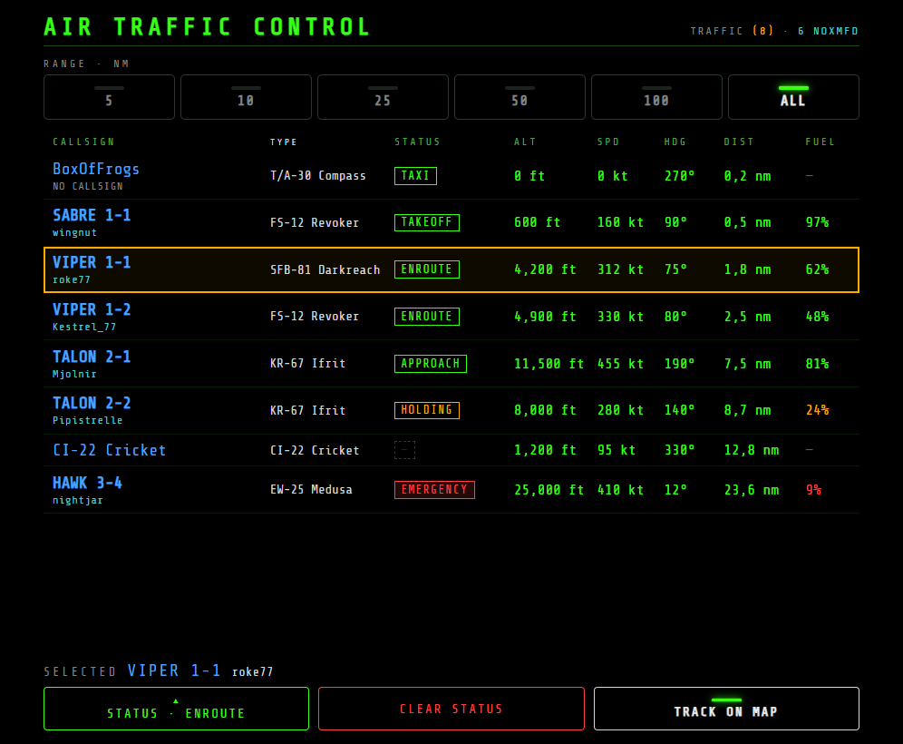
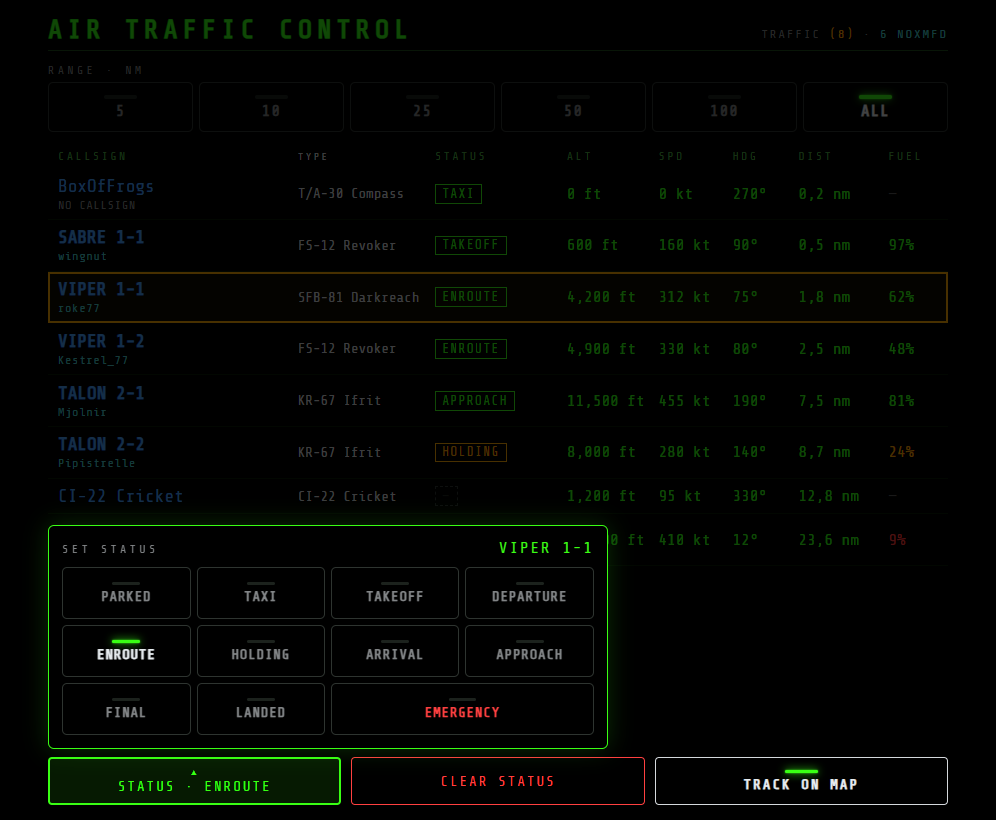

# NOXMFD Extension: ATC Module

[](https://github.com/roke77/NOXMFD)

[](LICENSE)

Adds an **ATC** page under [NOXMFD](https://github.com/roke77/NOXMFD)'s EXT nav — a
traffic-management / flight-progress MFD for a player acting as Air Traffic Control, per
[issue #89](https://github.com/roke77/NOXMFD/issues/89). The traffic table (callsign with the
pilot's Steam name, aircraft type, status, altitude, speed, heading, distance and fuel), range
presets that follow the game's Metric/Imperial setting, friendly traffic only, an ATC Status
assignment for the selected aircraft, a per-unit MAP status ring, and select-to-LOCATE-ON-MAP (plus
a TRACK ON MAP toggle that keeps MAP following the selected aircraft) are all built — see [`docs/atc-mfd-plan.md`](docs/atc-mfd-plan.md) for the full design and its one
remaining gap (two-way MAP↔ATC selection sync, left as a future exploration).



Pick an aircraft, then **STATUS** opens a list of statuses to assign it:



Built entirely through NOXMFD's public extension API — see NOXMFD's
[`EXTENSIONS.md`](https://github.com/roke77/NOXMFD/blob/main/EXTENSIONS.md). This repo does
**not** modify NOXMFD's own source.

## What's here

- `src/plugin/Plugin.cs` — registers the **ATC** EXT page.
- `src/plugin/AtcPageAssets.cs` — embedded-resource lookup for `src/web/`'s HTML/CSS/JS.
- `src/plugin/AtcStatus.cs` — the session-only ATC Status assignment map and its command handler.
- `src/web/atc.{html,css,js}` — the page itself, in NOXMFD's Lit Panel style: lit RANGE buttons, the traffic table (callsign with the pilot's Steam name beneath, type,
  status badge, ALT / SPD / HDG / DIST / FUEL), and an action bar for the selected aircraft: STATUS
  (opens a list of the 11 statuses), CLEAR STATUS and TRACK ON MAP.
- `tools/preview.py` — browser preview with mock traffic, no game needed
  (`python tools/preview.py [port]`).
- `tools/shot.py` — captures the two screenshots above from that preview (headless Chrome).
- `docs/` — planning doc (design decisions, phasing, what's built) — see
  [`atc-mfd-plan.md`](docs/atc-mfd-plan.md).
- `lib/NOXMFD.dll` — compile-time reference only, not shipped to players (NOXMFD is already
  installed as its own plugin; `Private=false` in the `.csproj` keeps this project from bundling a
  second copy). Committed to this repo since it's this project's own dependency.

## Building

Requires a local Nuclear Option install with BepInEx 5 and NOXMFD already installed. Create a
gitignored `GameDir.props` next to the `.csproj` if your install isn't the default Steam path:

```xml
<Project><PropertyGroup>
  <GameDir>D:\SteamLibrary\steamapps\common\Nuclear Option</GameDir>
</PropertyGroup></Project>
```

Then:

```bash
dotnet build AtcModule.csproj -c Release
```

The build's `DeployToGame` target copies the built DLL straight into
`$(GameDir)\BepInEx\plugins\` for you.

## Installing

1. Install BepInEx 5 and [NOXMFD](https://github.com/roke77/NOXMFD).
2. Drop `NOXMFD.AtcModule.dll` into `BepInEx/plugins/`.
3. Launch the game — an **ATC** entry appears under NOXMFD's EXT nav.
